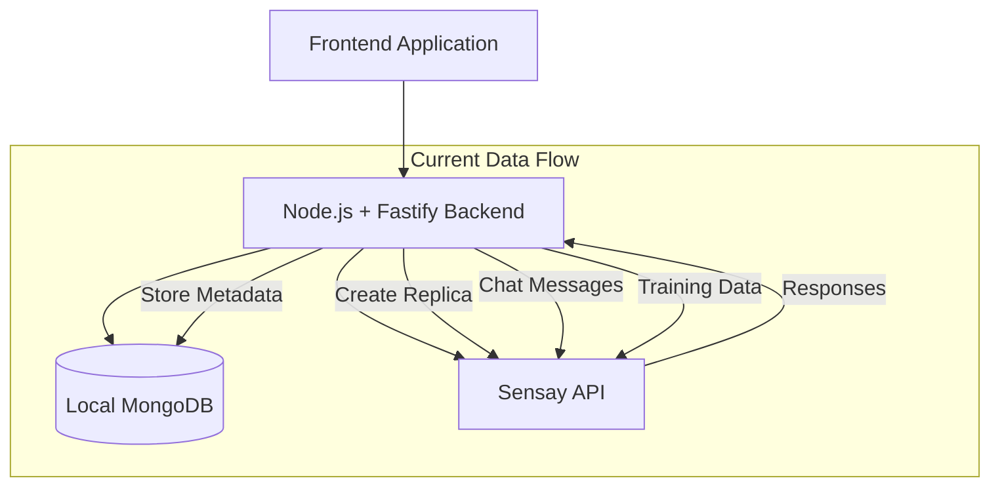
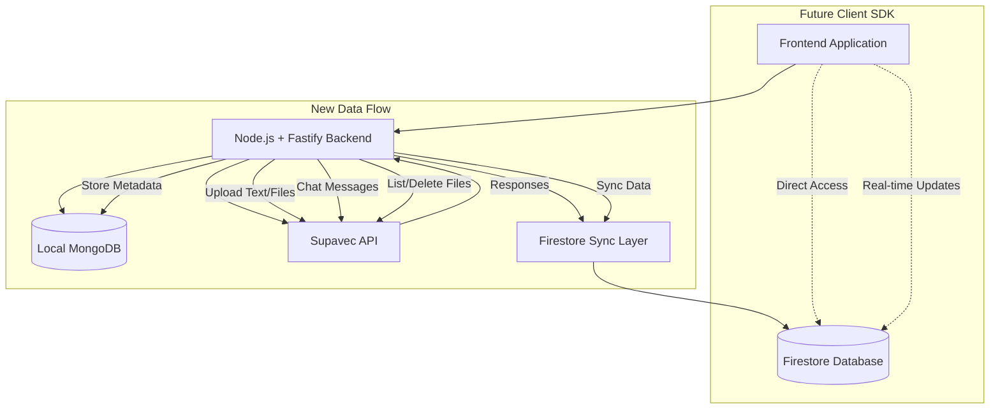
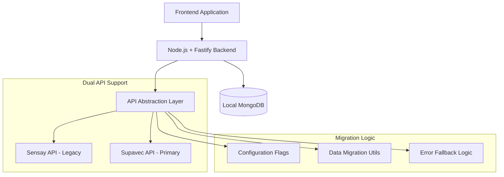
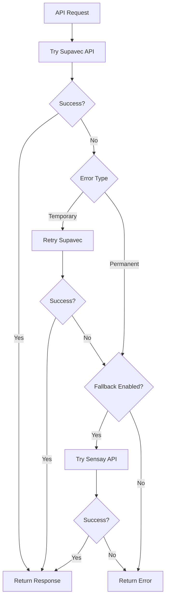

# Design Document

## Overview

This design document outlines the technical approach for migrating the MemoryLane backend from Sensay API to Supavec API. The migration follows a service abstraction pattern that allows for gradual transition while maintaining backward compatibility. The design emphasizes minimal frontend changes, robust error handling, and preparation for future Firestore client SDK integration.

## Architecture

### Current Architecture (Before Migration)



### Target Architecture (After Migration)



### Migration Transition Architecture



## Components and Interfaces

### 1. API Abstraction Layer

**Purpose**: Provide a unified interface that can route requests to either Sensay or Supavec APIs based on configuration and data state.

**Location**: `src/services/replicaAbstractionService.js`

**Key Functions**:
```javascript
// Core abstraction functions
async function createReplica(replicaData, userId)
async function listUserReplicas(userId)
async function sendChatMessage(replicaId, message, context, userId)
async function deleteReplica(replicaId, userId)
async function uploadTrainingContent(replicaId, content, userId)

// Migration utilities
async function migrateReplicaToSupavec(replicaId, userId)
async function validateReplicaAccess(replicaId, userId)
async function reconcileReplicaState(userId)
```

**Configuration Interface**:
```javascript
const migrationConfig = {
  useSupavecForNewReplicas: true,
  useSupavecForChat: true,
  enableSensayFallback: false,
  migrationMode: 'SUPAVEC_ONLY', // 'DUAL', 'SENSAY_ONLY', 'SUPAVEC_ONLY'
  namespaceStrategy: 'USER_ID' // How to map users to Supavec namespaces
}
```

### 2. Enhanced Supavec Service

**Purpose**: Extend the existing Supavec service with replica-specific functionality and error handling.

**Location**: `src/services/supavecService.js` (enhanced)

**New Functions**:
```javascript
// Replica management
async function createReplicaFromTrainingData(trainingData, namespace)
async function getReplicaById(replicaId, namespace)
async function updateReplicaMetadata(replicaId, metadata, namespace)

// Enhanced chat functionality
async function sendContextualChatMessage(messages, replicaIds, options)
async function streamChatResponse(messages, replicaIds, options)

// Namespace management
async function listNamespaceFiles(namespace, filters)
async function validateNamespaceAccess(namespace, userId)
```

### 3. Migration Service

**Purpose**: Handle data migration between Sensay and Supavec APIs.

**Location**: `src/services/migrationService.js`

**Key Functions**:
```javascript
// Migration operations
async function migrateSensayReplicaToSupavec(sensayReplicaId, userId)
async function bulkMigrateUserReplicas(userId)
async function validateMigrationIntegrity(userId)

// Data transformation
function transformSensayDataToSupavec(sensayData)
function transformSupavecDataToLocal(supavecData)
function mergeReplicaMetadata(localData, remoteData)
```

### 4. Firestore Sync Layer

**Purpose**: Prepare for future client SDK integration by providing secure data synchronization endpoints.

**Location**: `src/services/firestoreSyncService.js`

**Key Functions**:
```javascript
// Sync operations
async function syncReplicaToFirestore(replicaId, userId)
async function syncConversationToFirestore(conversationId, userId)
async function validateFirestoreAccess(userId, resourceId)

// Data transformation
function transformLocalToFirestoreFormat(localData)
function transformFirestoreToLocalFormat(firestoreData)
function generateFirestoreSecurityRules(userRoles)
```

## Data Models

### Enhanced Replica Model

```javascript
// Updated replica schema to support both APIs
const replicaSchema = {
  // Existing fields
  fileId: String, // Supavec file ID (primary)
  name: String,
  description: String,
  createdAt: Date,
  
  // Migration support fields
  sensayReplicaId: String, // Legacy Sensay ID
  apiSource: {
    type: String,
    enum: ['SENSAY', 'SUPAVEC', 'MIGRATED'],
    default: 'SUPAVEC'
  },
  migrationStatus: {
    type: String,
    enum: ['PENDING', 'IN_PROGRESS', 'COMPLETED', 'FAILED'],
    default: 'COMPLETED'
  },
  
  // Supavec-specific fields
  supavecNamespace: String, // User ID used as namespace
  supavecMetadata: Object, // Additional Supavec metadata
  
  // Access control (preserved)
  whitelistEmails: [String],
  selectedSegments: [String],
  
  // Audit fields
  lastSyncAt: Date,
  lastApiUsed: String, // 'SENSAY' or 'SUPAVEC'
  migrationLog: [Object] // Migration history
}
```

### Conversation Model Enhancement

```javascript
// Enhanced conversation schema for multi-API support
const conversationSchema = {
  // Existing fields
  userId: ObjectId,
  replicaId: String,
  messages: [Object],
  
  // API tracking
  apiSource: {
    type: String,
    enum: ['SENSAY', 'SUPAVEC'],
    default: 'SUPAVEC'
  },
  
  // Firestore sync preparation
  firestoreDocId: String,
  lastFirestoreSync: Date,
  syncStatus: {
    type: String,
    enum: ['PENDING', 'SYNCED', 'FAILED'],
    default: 'PENDING'
  }
}
```

## Error Handling

### API Error Mapping

```javascript
// Standardized error handling across APIs
const errorMappingStrategy = {
  // Supavec to standard errors
  supavecErrors: {
    401: 'UNAUTHORIZED',
    403: 'FORBIDDEN', 
    404: 'NOT_FOUND',
    429: 'RATE_LIMITED',
    500: 'SERVICE_ERROR'
  },
  
  // Sensay to standard errors (for fallback)
  sensayErrors: {
    401: 'UNAUTHORIZED',
    403: 'FORBIDDEN',
    404: 'NOT_FOUND', 
    429: 'RATE_LIMITED',
    500: 'SERVICE_ERROR'
  }
}
```

### Fallback Strategy



## Testing Strategy

### 1. Unit Testing

**Scope**: Individual service functions and data transformations

**Key Test Areas**:
- Supavec service function calls with various parameters
- Data transformation between API formats
- Error handling and fallback logic
- Configuration validation

**Test Files**:
- `tests/services/supavecService.test.js`
- `tests/services/migrationService.test.js`
- `tests/services/replicaAbstractionService.test.js`

### 2. Integration Testing

**Scope**: End-to-end API workflows and database interactions

**Key Test Scenarios**:
- Complete replica creation workflow using Supavec
- Chat message flow with conversation persistence
- Migration from Sensay to Supavec data
- Patient access control validation

**Test Files**:
- `tests/integration/supavecMigration.test.js`
- `tests/integration/replicaWorkflow.test.js`

### 3. Migration Testing

**Scope**: Data integrity during API transition

**Key Test Areas**:
- Replica data consistency between APIs
- Conversation history preservation
- Access control migration
- Rollback scenarios

**Test Strategy**:
```javascript
// Migration test pattern
describe('Sensay to Supavec Migration', () => {
  beforeEach(async () => {
    // Set up test data in Sensay format
    await setupSensayTestData()
  })
  
  it('should migrate replica while preserving all metadata', async () => {
    const originalReplica = await getTestReplica()
    const migratedReplica = await migrationService.migrateSensayReplicaToSupavec(originalReplica.id)
    
    expect(migratedReplica.name).toBe(originalReplica.name)
    expect(migratedReplica.apiSource).toBe('SUPAVEC')
    expect(migratedReplica.migrationStatus).toBe('COMPLETED')
  })
})
```

## Implementation Phases

### Phase 1: Core Service Migration (Week 1-2)

**Deliverables**:
- Enhanced Supavec service with replica-specific functions
- API abstraction layer with configuration support
- Updated replica creation endpoint to use Supavec
- Basic error handling and logging

**Success Criteria**:
- New replicas created successfully via Supavec API
- Existing Sensay replicas remain accessible
- No breaking changes to frontend interface

### Phase 2: Chat and Training Migration (Week 3-4)

**Deliverables**:
- Chat endpoint migration to Supavec
- Training content upload via Supavec
- Conversation history preservation
- Enhanced error handling with fallback support

**Success Criteria**:
- Chat functionality works with Supavec-created replicas
- Training workflows complete successfully
- Performance metrics meet or exceed Sensay baseline

### Phase 3: Data Migration and Cleanup (Week 5-6)

**Deliverables**:
- Migration service for existing Sensay data
- Bulk migration utilities for administrators
- Data integrity validation tools
- Sensay API deprecation path

**Success Criteria**:
- All existing replicas migrated to Supavec format
- Data integrity validated across all user accounts
- Sensay API dependencies removed from production

### Phase 4: Firestore Preparation (Week 7-8)

**Deliverables**:
- Firestore sync service implementation
- Client SDK integration documentation
- Security rules and access patterns
- Performance optimization for real-time features

**Success Criteria**:
- Firestore sync endpoints operational
- Client SDK integration patterns documented
- Real-time conversation updates functional
- Security model validated

## Security Considerations

### API Key Management

```javascript
// Secure configuration pattern
const apiConfig = {
  supavec: {
    apiKey: process.env.SUPAVEC_API_KEY,
    baseUrl: process.env.SUPAVEC_BASE_URL || 'https://api.supavec.com',
    timeout: parseInt(process.env.SUPAVEC_TIMEOUT) || 30000
  },
  sensay: {
    organizationSecret: process.env.SENSAY_ORGANIZATION_SECRET,
    baseUrl: process.env.SENSAY_BASE_URL || 'https://api.sensay.io',
    enabled: process.env.SENSAY_FALLBACK_ENABLED === 'true'
  }
}
```

### Namespace Security

**Strategy**: Use authenticated user IDs as Supavec namespaces to ensure data isolation

**Implementation**:
- Caretaker user ID = Supavec namespace for their replicas
- Patient access validated through local whitelist + namespace verification
- Cross-namespace access strictly prohibited
- Audit logging for all namespace operations

### Firestore Security Rules

```javascript
// Example Firestore security rules for future client SDK
rules_version = '2';
service cloud.firestore {
  match /databases/{database}/documents {
    // Users can only access their own data
    match /users/{userId} {
      allow read, write: if request.auth != null && request.auth.uid == userId;
      
      // Replicas owned by the user
      match /replicas/{replicaId} {
        allow read, write: if request.auth != null && request.auth.uid == userId;
      }
      
      // Conversations for the user
      match /conversations/{conversationId} {
        allow read, write: if request.auth != null && request.auth.uid == userId;
      }
    }
    
    // Shared replicas (patient access)
    match /shared/{shareId} {
      allow read: if request.auth != null && 
        resource.data.allowedUsers[request.auth.uid] == true;
    }
  }
}
```

## Performance Optimization

### Caching Strategy

```javascript
// Multi-layer caching approach
const cacheStrategy = {
  // In-memory cache for frequently accessed replicas
  replicaCache: new Map(), // TTL: 5 minutes
  
  // Redis cache for conversation context
  conversationCache: redisClient, // TTL: 1 hour
  
  // Local database cache for user permissions
  permissionCache: new Map() // TTL: 15 minutes
}
```

### API Rate Limiting

```javascript
// Supavec API rate limiting configuration
const rateLimitConfig = {
  supavec: {
    maxRequestsPerMinute: 100,
    maxConcurrentRequests: 10,
    backoffStrategy: 'exponential'
  },
  
  // Batch operations for efficiency
  batchSize: {
    replicaList: 50,
    conversationSync: 25,
    trainingUpload: 10
  }
}
```

## Monitoring and Observability

### Metrics Collection

```javascript
// Key metrics to track during migration
const migrationMetrics = {
  // API performance
  'api.supavec.response_time': 'histogram',
  'api.supavec.error_rate': 'counter',
  'api.sensay.fallback_usage': 'counter',
  
  // Migration progress
  'migration.replicas_migrated': 'counter',
  'migration.data_integrity_checks': 'counter',
  'migration.rollback_events': 'counter',
  
  // User experience
  'chat.response_quality': 'histogram',
  'replica.creation_success_rate': 'gauge',
  'conversation.sync_latency': 'histogram'
}
```

### Logging Strategy

```javascript
// Structured logging for migration tracking
const migrationLogger = {
  logReplicaCreation: (userId, replicaId, apiUsed) => {
    logger.info('replica_created', {
      userId,
      replicaId,
      apiSource: apiUsed,
      timestamp: new Date().toISOString()
    })
  },
  
  logMigrationEvent: (userId, eventType, details) => {
    logger.info('migration_event', {
      userId,
      eventType,
      details,
      timestamp: new Date().toISOString()
    })
  }
}
```

## Prisma Removal Strategy

### Current State Analysis

The codebase currently has Prisma artifacts (schema files, references in code) but the actual database layer uses MongoDB with Mongoose. This creates confusion and maintenance overhead.

### Removal Approach

**Files to Remove**:
- `backend/prisma/schema.prisma` - PostgreSQL schema definition
- `backend/prisma/migrations/` - All migration files
- Prisma-related Docker and deployment commands

**Code References to Update**:
```javascript
// BEFORE (Prisma references in tests)
await databaseConfig.prisma.user.deleteMany({ where: { email: 'test@example.com' } });
await databaseConfig.prisma.$disconnect();

// AFTER (MongoDB/Mongoose)
await User.deleteMany({ email: 'test@example.com' });
await mongoose.connection.close();
```

**Configuration Updates**:
- Remove Prisma from `package.json` dependencies
- Remove Prisma from `pnpm-workspace.yaml` build dependencies
- Remove `npx prisma db push` from `fly.toml` release command
- Remove `npx prisma generate` from `Dockerfile`
- Remove Prisma-related environment variables from `.env.example`

**Documentation Updates**:
- Update `README.md` to remove Prisma references
- Update architecture diagrams to show MongoDB only
- Remove Prisma setup instructions
- Update deployment guides to remove Prisma steps