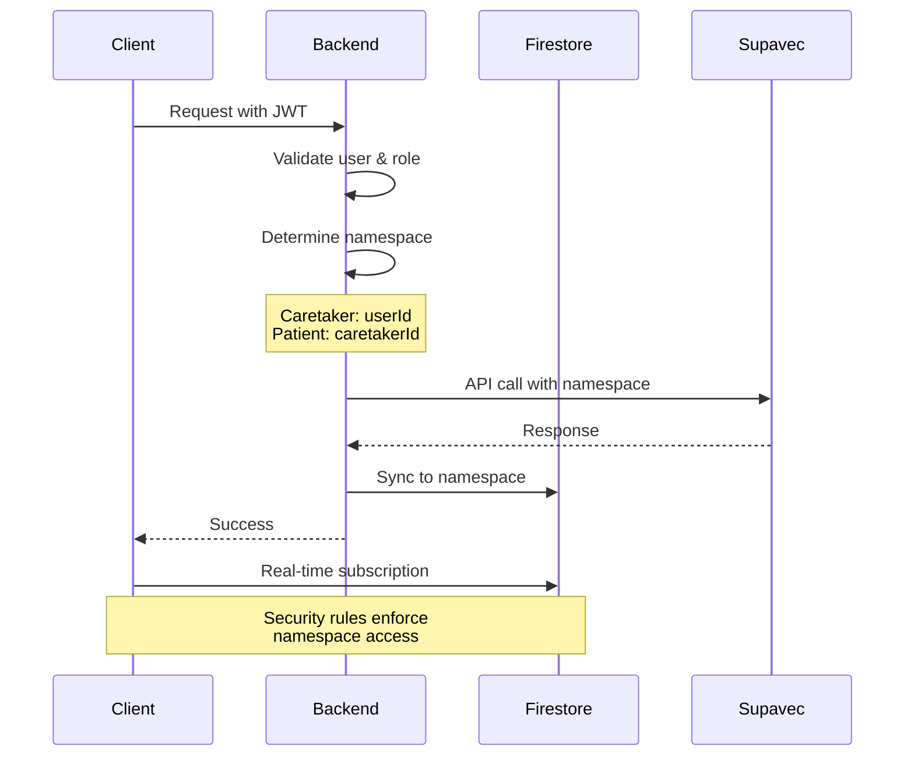

# Firestore Client SDK Integration Guide

This document provides comprehensive guidance for integrating the Firestore Client SDK with the MemoryLane application, enabling direct browser-to-database connections for real-time updates while maintaining security.

## Table of Contents

1. [Overview](#overview)
2. [Security Model](#security-model)
3. [Firestore Security Rules](#firestore-security-rules)
4. [Client SDK Setup](#client-sdk-setup)
5. [Data Access Patterns](#data-access-patterns)
6. [Example Implementations](#example-implementations)
7. [Best Practices](#best-practices)

## Overview

The Firestore sync layer enables:
- **Real-time updates**: Conversations and replicas sync automatically
- **Offline support**: Client SDK provides offline persistence
- **Reduced server load**: Direct database access for reads
- **Better UX**: Instant updates without polling

### Architecture

```
┌─────────────┐
│   Browser   │
│  (Client)   │
└──────┬──────┘
       │
       ├─────────────────┐
       │                 │
       ▼                 ▼
┌─────────────┐   ┌──────────────┐
│  Firestore  │   │   Backend    │
│  (Direct)   │   │   (API)      │
└─────────────┘   └──────┬───────┘
                         │
                         ▼
                  ┌──────────────┐
                  │  PostgreSQL  │
                  └──────────────┘
```

**Data Flow:**
1. Backend writes to PostgreSQL (source of truth)
2. Backend syncs data to Firestore (via sync service)
3. Client reads from Firestore directly (real-time)
4. Client writes through Backend API (validation & security)

## Security Model

### Namespace-Aware Access Control

The security model uses **user IDs as namespaces** to ensure data isolation:

- **Caretakers**: Own their namespace (`users/{userId}`)
- **Patients**: Access shared replicas from caretaker namespaces
- **Cross-namespace access**: Strictly controlled via whitelist

#### Namespace Architecture

```
Firestore Structure:
/users/{caretakerId}/                    ← Caretaker's namespace
  /replicas/{replicaId}                  ← Caretaker's replicas
  /conversations/{conversationId}        ← Caretaker's conversations

/shared/{shareId}                        ← Cross-namespace sharing
  - replicaId: "replica-123"
  - caretakerId: "caretaker-user-id"
  - sharedWith: ["patient@email.com"]
  - replicaData: { ... }

/patients/{patientId}/                   ← Patient metadata
  - userId: "patient-user-id"
  - caretakerId: "caretaker-user-id"
  - accessibleReplicas: ["replica-123"]
```

#### Namespace Isolation Principles

1. **Data Ownership**: All replicas and conversations belong to a caretaker's namespace
2. **No Direct Patient Writes**: Patients cannot write to any namespace directly
3. **Controlled Sharing**: Access is granted via `/shared` collection with explicit whitelist
4. **Audit Trail**: All cross-namespace access is logged and traceable
5. **Namespace Validation**: Backend validates namespace access before syncing to Firestore

### Authentication Flow

```javascript
// 1. User authenticates with Firebase Auth
const userCredential = await signInWithCustomToken(auth, customToken);

// 2. Backend validates and issues custom token
// POST /api/auth/firebase-token
const response = await fetch('/api/auth/firebase-token', {
  headers: { 'Authorization': `Bearer ${accessToken}` }
});
const { customToken } = await response.json();

// 3. Client uses authenticated connection to Firestore
const db = getFirestore();
```

#### Custom Token Generation (Backend)

The backend generates Firebase custom tokens with user role claims:

```javascript
// Backend: src/routes/authRoutes.js
import admin from 'firebase-admin';

async function generateFirebaseToken(req, reply) {
  const userId = req.user.id;
  const userRole = req.user.role; // 'caretaker' or 'patient'
  
  // Create custom token with claims
  const customToken = await admin.auth().createCustomToken(userId, {
    role: userRole,
    email: req.user.email,
    namespace: userRole === 'caretaker' ? userId : req.user.caretakerId
  });
  
  return { customToken };
}
```

#### Security Token Claims

Custom tokens include these claims for security rule evaluation:

- `role`: User role ('caretaker' or 'patient')
- `email`: User email for whitelist validation
- `namespace`: The namespace the user can access
  - Caretakers: Their own user ID
  - Patients: Their caretaker's user ID

## Firestore Security Rules

### Complete Security Rules

Save this as `firestore.rules` in your Firebase project:

```javascript
rules_version = '2';
service cloud.firestore {
  match /databases/{database}/documents {
    
    // Helper functions
    function isAuthenticated() {
      return request.auth != null;
    }
    
    function isOwner(userId) {
      return isAuthenticated() && request.auth.uid == userId;
    }
    
    function hasRole(role) {
      return isAuthenticated() && 
             get(/databases/$(database)/documents/users/$(request.auth.uid)).data.role == role;
    }
    
    function isCaretaker() {
      return hasRole('caretaker');
    }
    
    function isPatient() {
      return hasRole('patient');
    }
    
    // User documents - users can only access their own data
    match /users/{userId} {
      allow read: if isOwner(userId);
      allow write: if false; // Only backend can write user data
      
      // User's replicas - full access for owner
      match /replicas/{replicaId} {
        allow read: if isOwner(userId);
        allow write: if false; // Only backend can write replica data
      }
      
      // User's conversations - full access for owner
      match /conversations/{conversationId} {
        allow read: if isOwner(userId);
        allow write: if false; // Only backend can write conversation data
      }
    }
    
    // Shared replicas - patient access via whitelist
    match /shared/{shareId} {
      allow read: if isAuthenticated() && 
                     resource.data.sharedWith.hasAny([request.auth.uid, 
                                                       get(/databases/$(database)/documents/users/$(request.auth.uid)).data.email]);
      allow write: if false; // Only backend can manage sharing
    }
    
    // Patient access records
    match /patients/{patientId} {
      allow read: if isAuthenticated() && 
                     (resource.data.userId == request.auth.uid || 
                      resource.data.caretakerId == request.auth.uid);
      allow write: if false; // Only backend can manage patient records
    }
    
    // Deny all other access
    match /{document=**} {
      allow read, write: if false;
    }
  }
}
```

### Security Rules Explanation

#### User Data Access
- Users can **read** their own data under `/users/{userId}`
- Users **cannot write** directly - all writes go through backend API
- This ensures data validation and business logic enforcement

#### Replica Access
- **Caretakers**: Access replicas in their namespace
- **Patients**: Access replicas shared via whitelist (see shared access)

#### Shared Access Pattern
```javascript
// Backend creates shared access document
/shared/{shareId} = {
  replicaId: "replica-123",
  caretakerId: "caretaker-user-id",
  sharedWith: ["patient@email.com", "patient-user-id"],
  replicaData: { /* replica info */ }
}

// Patient can read this document if their email/uid is in sharedWith
```

## Client SDK Setup

### Installation

```bash
npm install firebase
```

### Initialize Firebase Client

```javascript
// src/lib/firebase-client.js
import { initializeApp } from 'firebase/app';
import { getAuth, signInWithCustomToken } from 'firebase/auth';
import { getFirestore, enableIndexedDbPersistence } from 'firebase/firestore';

const firebaseConfig = {
  apiKey: import.meta.env.VITE_FIREBASE_API_KEY,
  authDomain: import.meta.env.VITE_FIREBASE_AUTH_DOMAIN,
  projectId: import.meta.env.VITE_FIREBASE_PROJECT_ID,
  storageBucket: import.meta.env.VITE_FIREBASE_STORAGE_BUCKET,
  messagingSenderId: import.meta.env.VITE_FIREBASE_MESSAGING_SENDER_ID,
  appId: import.meta.env.VITE_FIREBASE_APP_ID
};

// Initialize Firebase
const app = initializeApp(firebaseConfig);
const auth = getAuth(app);
const db = getFirestore(app);

// Enable offline persistence
enableIndexedDbPersistence(db).catch((err) => {
  if (err.code === 'failed-precondition') {
    console.warn('Persistence failed: Multiple tabs open');
  } else if (err.code === 'unimplemented') {
    console.warn('Persistence not available in this browser');
  }
});

export { auth, db, signInWithCustomToken };
```

### Authentication Helper

```javascript
// src/lib/firebase-auth.js
import { auth, signInWithCustomToken } from './firebase-client.js';

/**
 * Authenticate with Firebase using custom token from backend
 * @param {string} backendAccessToken - JWT from backend auth
 * @returns {Promise<object>} Firebase user credential
 */
export async function authenticateWithFirebase(backendAccessToken) {
  try {
    // Get custom token from backend
    const response = await fetch('/api/auth/firebase-token', {
      headers: {
        'Authorization': `Bearer ${backendAccessToken}`
      }
    });
    
    if (!response.ok) {
      throw new Error('Failed to get Firebase custom token');
    }
    
    const { customToken } = await response.json();
    
    // Sign in with custom token
    const userCredential = await signInWithCustomToken(auth, customToken);
    
    return userCredential;
  } catch (error) {
    console.error('Firebase authentication error:', error);
    throw error;
  }
}

/**
 * Sign out from Firebase
 */
export async function signOutFromFirebase() {
  try {
    await auth.signOut();
  } catch (error) {
    console.error('Firebase sign out error:', error);
    throw error;
  }
}
```

## Namespace-Aware Access Patterns

### Understanding Namespaces in MemoryLane

Namespaces provide data isolation and security in the Supavec + Firestore architecture:

#### Caretaker Namespace Access

```javascript
// Caretakers access their own namespace
const userId = currentUser.id; // Caretaker's user ID
const namespace = userId; // Namespace = User ID

// Access own replicas
const replicasRef = collection(db, 'users', namespace, 'replicas');

// Access own conversations
const conversationsRef = collection(db, 'users', namespace, 'conversations');
```

#### Patient Cross-Namespace Access

```javascript
// Patients access caretaker's namespace via shared collection
const patientEmail = currentUser.email;

// Query shared replicas
const sharedRef = collection(db, 'shared');
const q = query(
  sharedRef,
  where('sharedWith', 'array-contains', patientEmail)
);

// Each shared document contains:
// - caretakerId: The namespace to access
// - replicaId: The replica in that namespace
// - replicaData: Cached replica information
```

#### Namespace Validation Flow



### Namespace Security Rules

```javascript
// Helper function to get user's allowed namespace
function getAllowedNamespace() {
  // Custom claims set during token generation
  return request.auth.token.namespace;
}

// Validate namespace access
function canAccessNamespace(namespace) {
  return isAuthenticated() && getAllowedNamespace() == namespace;
}

// Example usage in security rules
match /users/{userId}/replicas/{replicaId} {
  allow read: if canAccessNamespace(userId);
}
```

## Data Access Patterns

### Pattern 1: Real-time Conversation Updates

```javascript
// src/lib/firestore-conversations.js
import { db } from './firebase-client.js';
import { 
  collection, 
  doc, 
  onSnapshot, 
  query, 
  where, 
  orderBy 
} from 'firebase/firestore';

/**
 * Subscribe to real-time conversation updates
 * @param {string} userId - Current user ID
 * @param {string} replicaId - Replica ID
 * @param {function} callback - Callback for updates
 * @returns {function} Unsubscribe function
 */
export function subscribeToConversation(userId, conversationId, callback) {
  const conversationRef = doc(
    db, 
    'users', 
    userId, 
    'conversations', 
    conversationId
  );
  
  return onSnapshot(conversationRef, (snapshot) => {
    if (snapshot.exists()) {
      callback({
        success: true,
        conversation: snapshot.data()
      });
    } else {
      callback({
        success: false,
        error: 'Conversation not found'
      });
    }
  }, (error) => {
    callback({
      success: false,
      error: error.message
    });
  });
}

/**
 * Subscribe to all user conversations
 * @param {string} userId - Current user ID
 * @param {function} callback - Callback for updates
 * @returns {function} Unsubscribe function
 */
export function subscribeToUserConversations(userId, callback) {
  const conversationsRef = collection(db, 'users', userId, 'conversations');
  const q = query(
    conversationsRef, 
    where('isActive', '==', true),
    orderBy('lastMessageAt', 'desc')
  );
  
  return onSnapshot(q, (snapshot) => {
    const conversations = [];
    snapshot.forEach((doc) => {
      conversations.push({
        id: doc.id,
        ...doc.data()
      });
    });
    
    callback({
      success: true,
      conversations
    });
  }, (error) => {
    callback({
      success: false,
      error: error.message
    });
  });
}
```

### Pattern 2: Replica Access

```javascript
// src/lib/firestore-replicas.js
import { db } from './firebase-client.js';
import { collection, doc, getDoc, getDocs } from 'firebase/firestore';

/**
 * Get user's replicas
 * @param {string} userId - Current user ID
 * @returns {Promise<array>} Array of replicas
 */
export async function getUserReplicas(userId) {
  try {
    const replicasRef = collection(db, 'users', userId, 'replicas');
    const snapshot = await getDocs(replicasRef);
    
    const replicas = [];
    snapshot.forEach((doc) => {
      replicas.push({
        id: doc.id,
        ...doc.data()
      });
    });
    
    return {
      success: true,
      replicas
    };
  } catch (error) {
    return {
      success: false,
      error: error.message
    };
  }
}

/**
 * Get a specific replica
 * @param {string} userId - User ID (namespace)
 * @param {string} replicaId - Replica ID
 * @returns {Promise<object>} Replica data
 */
export async function getReplica(userId, replicaId) {
  try {
    const replicaRef = doc(db, 'users', userId, 'replicas', replicaId);
    const snapshot = await getDoc(replicaRef);
    
    if (!snapshot.exists()) {
      return {
        success: false,
        error: 'Replica not found'
      };
    }
    
    return {
      success: true,
      replica: {
        id: snapshot.id,
        ...snapshot.data()
      }
    };
  } catch (error) {
    return {
      success: false,
      error: error.message
    };
  }
}
```

### Pattern 3: Patient Shared Access

```javascript
// src/lib/firestore-shared.js
import { db } from './firebase-client.js';
import { collection, query, where, getDocs } from 'firebase/firestore';

/**
 * Get replicas shared with patient
 * @param {string} patientEmail - Patient email
 * @returns {Promise<array>} Array of shared replicas
 */
export async function getSharedReplicas(patientEmail) {
  try {
    const sharedRef = collection(db, 'shared');
    const q = query(
      sharedRef,
      where('sharedWith', 'array-contains', patientEmail)
    );
    
    const snapshot = await getDocs(q);
    
    const sharedReplicas = [];
    snapshot.forEach((doc) => {
      const data = doc.data();
      sharedReplicas.push({
        id: doc.id,
        replicaId: data.replicaId,
        caretakerId: data.caretakerId,
        replicaData: data.replicaData
      });
    });
    
    return {
      success: true,
      replicas: sharedReplicas
    };
  } catch (error) {
    return {
      success: false,
      error: error.message
    };
  }
}
```

## Example Implementations

### Svelte 5 Real-time Chat Component

```svelte
<script>
  import { onMount, onDestroy } from 'svelte';
  import { subscribeToConversation } from '$lib/firestore-conversations.js';
  
  let { userId, conversationId } = $props();
  let conversation = $state(null);
  let messages = $state([]);
  let unsubscribe = null;
  
  onMount(() => {
    // Subscribe to real-time updates
    unsubscribe = subscribeToConversation(userId, conversationId, (result) => {
      if (result.success) {
        conversation = result.conversation;
        messages = result.conversation.messages || [];
      } else {
        console.error('Conversation update error:', result.error);
      }
    });
  });
  
  onDestroy(() => {
    // Clean up subscription
    if (unsubscribe) {
      unsubscribe();
    }
  });
  
  async function sendMessage(text) {
    // Send through backend API (not directly to Firestore)
    const response = await fetch(`/api/replicas/${conversation.replicaId}/chat`, {
      method: 'POST',
      headers: {
        'Content-Type': 'application/json',
        'Authorization': `Bearer ${accessToken}`
      },
      body: JSON.stringify({
        message: text,
        conversationId
      })
    });
    
    // Firestore will update automatically via backend sync
  }
</script>

<div class="chat-window">
  {#each messages as message}
    <div class="message {message.sender}">
      <p>{message.text}</p>
      <span class="timestamp">{new Date(message.timestamp).toLocaleTimeString()}</span>
    </div>
  {/each}
</div>
```

### Svelte 5 Replica List Component

```svelte
<script>
  import { onMount } from 'svelte';
  import { getUserReplicas } from '$lib/firestore-replicas.js';
  
  let { userId } = $props();
  let replicas = $state([]);
  let loading = $state(true);
  
  onMount(async () => {
    const result = await getUserReplicas(userId);
    if (result.success) {
      replicas = result.replicas;
    }
    loading = false;
  });
</script>

{#if loading}
  <p>Loading replicas...</p>
{:else}
  <div class="replica-list">
    {#each replicas as replica}
      <div class="replica-card">
        <h3>{replica.name}</h3>
        <p>{replica.description}</p>
        <span class="api-source">{replica.apiSource}</span>
      </div>
    {/each}
  </div>
{/if}
```

## Best Practices

### 1. Always Write Through Backend

```javascript
// ❌ DON'T: Write directly to Firestore
await setDoc(doc(db, 'users', userId, 'replicas', replicaId), data);

// ✅ DO: Write through backend API
await fetch('/api/replicas', {
  method: 'POST',
  body: JSON.stringify(data)
});
// Backend will sync to Firestore automatically
```

### 2. Handle Offline State

```javascript
import { onSnapshot } from 'firebase/firestore';

const unsubscribe = onSnapshot(
  docRef,
  { includeMetadataChanges: true },
  (snapshot) => {
    const source = snapshot.metadata.fromCache ? 'cache' : 'server';
    console.log('Data source:', source);
    
    if (snapshot.metadata.hasPendingWrites) {
      console.log('Local changes pending sync');
    }
  }
);
```

### 3. Optimize Queries

```javascript
// ❌ DON'T: Fetch all conversations
const allConversations = await getDocs(collection(db, 'users', userId, 'conversations'));

// ✅ DO: Use queries with limits
const recentConversations = await getDocs(
  query(
    collection(db, 'users', userId, 'conversations'),
    where('isActive', '==', true),
    orderBy('lastMessageAt', 'desc'),
    limit(20)
  )
);
```

### 4. Clean Up Subscriptions

```javascript
// Always unsubscribe when component unmounts
onDestroy(() => {
  if (unsubscribe) {
    unsubscribe();
  }
});
```

### 5. Error Handling

```javascript
try {
  const result = await getUserReplicas(userId);
  if (!result.success) {
    // Handle error gracefully
    showNotification('Failed to load replicas', 'error');
    console.error(result.error);
  }
} catch (error) {
  // Handle unexpected errors
  showNotification('An unexpected error occurred', 'error');
  console.error(error);
}
```

### 6. Security Considerations

- **Never expose sensitive data**: Passwords, tokens, etc. should never be in Firestore
- **Validate on backend**: All writes must go through backend for validation
- **Use custom claims**: Store user roles in Firebase Auth custom claims
- **Monitor access**: Use Firebase Console to monitor security rule violations
- **Test security rules**: Use Firebase Emulator Suite to test rules

### 7. Performance Optimization

```javascript
// Use pagination for large datasets
let lastVisible = null;

async function loadMoreConversations() {
  const q = lastVisible
    ? query(
        conversationsRef,
        orderBy('lastMessageAt', 'desc'),
        startAfter(lastVisible),
        limit(20)
      )
    : query(
        conversationsRef,
        orderBy('lastMessageAt', 'desc'),
        limit(20)
      );
  
  const snapshot = await getDocs(q);
  lastVisible = snapshot.docs[snapshot.docs.length - 1];
  
  return snapshot.docs.map(doc => ({ id: doc.id, ...doc.data() }));
}
```

## Backend Endpoints for Client SDK

### Generate Firebase Custom Token

```javascript
// POST /api/auth/firebase-token
// Returns custom token for Firebase authentication
```

### Sync Data to Firestore

```javascript
// POST /api/sync/replica/:replicaId
// Manually trigger replica sync to Firestore

// POST /api/sync/conversation/:conversationId
// Manually trigger conversation sync to Firestore

// POST /api/sync/user
// Sync all user data to Firestore
```

## Monitoring and Debugging

### Enable Debug Logging

```javascript
import { setLogLevel } from 'firebase/firestore';

// In development
if (import.meta.env.DEV) {
  setLogLevel('debug');
}
```

### Monitor Security Rule Violations

Check Firebase Console → Firestore → Rules → Monitoring for:
- Denied read/write attempts
- Performance issues
- Rule evaluation errors

## Migration Path

1. **Phase 1**: Backend syncs data to Firestore (current implementation)
2. **Phase 2**: Client reads from Firestore for real-time updates
3. **Phase 3**: Optimize queries and add indexes
4. **Phase 4**: Full offline support with conflict resolution

## Additional Resources

- [Firebase Documentation](https://firebase.google.com/docs)
- [Firestore Security Rules](https://firebase.google.com/docs/firestore/security/get-started)
- [Svelte Firebase Integration](https://github.com/codediodeio/sveltefire)
- [Firebase Emulator Suite](https://firebase.google.com/docs/emulator-suite)
